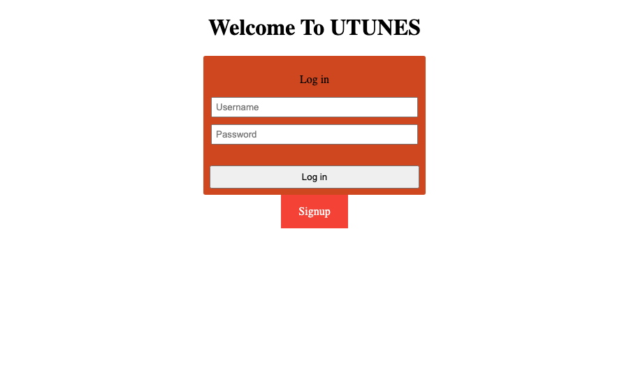
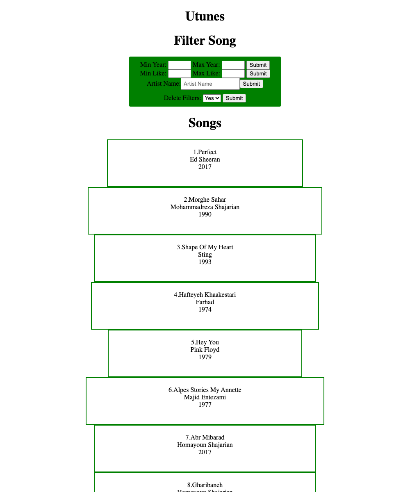
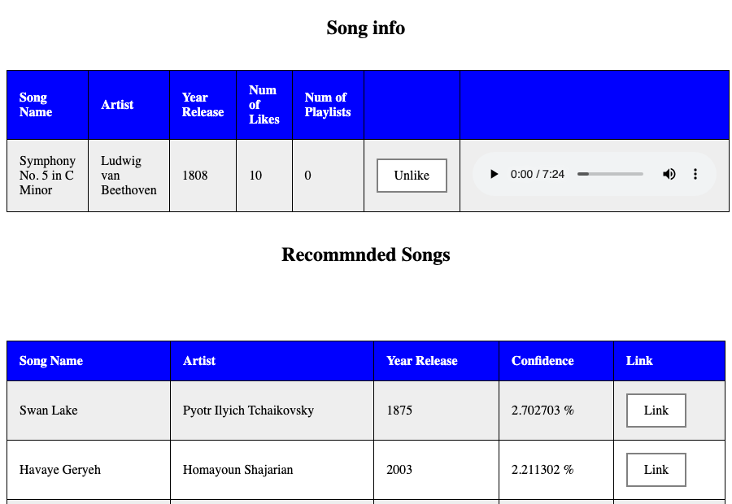

# C++ Projects

Seven programs written for an advanced programming course: simulators, games,
and a music service with two front ends, one of them an HTTP server written from
sockets up.

```bash
make            # everything except Soccer Stars
make everything # including Soccer Stars, which needs SDL2
```

Each project also builds on its own, and all of them compile clean under
`-Wall -Wextra`:

```bash
make -C projects/utunes-server
```

## uTunes

A music service holding songs, users, playlists and likes, built twice against
one domain model: `projects/utunes-cli` reads commands on standard input,
`projects/utunes-server` puts the same thing behind HTTP.

```bash
make -C projects/utunes-server
./projects/utunes-server/utunes-server \
    projects/utunes-server/data/songs.csv \
    projects/utunes-server/data/liked_songs.csv
# then open http://localhost:5030/login
```



The library, rendered by the server's own templating:



A song page, with like counts, an audio element, and the recommendations
computed for the logged-in listener:



### The same answers on the command line

```
$ ./projects/utunes-cli/utunes data/songs.csv data/liked_songs.csv
POST login ? email ava.hart@example.com password ava_hart_pw
OK
GET recommended ? count 5
16 2.70% Swan Lake Pyotr Ilyich Tchaikovsky 1875
10 2.21% Havaye Geryeh Homayoun Shajarian 2003
27 2.13% Behet Ghol Midam Mohsen Yeganeh 2015
7 2.13% Abr Mibarad Homayoun Shajarian 2017
24 1.88% Khiale Khoosh Alireza Ghorbani 2020
GET similar_users ? count 3
15.15% theo_hart
12.12% freya_hart
12.12% ruby_hart
```

Recommendations come from user similarity: each user is a bit vector over the
songs they liked, similarity is the overlap between two such vectors, and a
song's score is the similarity-weighted count of users who liked it. Both front
ends give Swan Lake 2.70%, because both call the same code.

Filters compose through a `criteria` interface — by artist, by year, by likes —
so a query is a list of filters applied in turn rather than a special case per
combination.

## Mafia

`projects/mafia` runs the party game: roles with different night actions, day
voting, and the state machine between night and day.

```
$ ./projects/mafia/mafia
create_game ava noah mia liam zoe
assign_role ava godfather
assign_role noah detective
assign_role mia doctor
assign_role liam villager
assign_role zoe villager
ava: godfather
noah: detective
mia: doctor
liam: villager
zoe: villager
start_game
Ready? Set! Go.
get_game_state
Day 1
Mafia = 1
Villager = 4
```

Rules that cannot be satisfied raise typed exceptions rather than returning
error codes, one class per rule — `VOTER_IS_SILENCED`, `PATIENT_IS_DEAD`,
`CANT_SWAP_BEFORE_END_NIGHT` — so an invalid command is refused where it becomes
invalid and names itself.

## Cinema

`projects/cinema` reads a schedule of films, halls and showings from CSV and
answers queries about it, including a week view drawn in the terminal.

```
$ ./projects/cinema/cinema projects/cinema/data/schedule.csv
GET SCHEDULE Pulp Fiction
          08:00               10:00               12:00               14:00
          +-----------------------------+-----------------------------+
Saturday  |Alborz                       |Koorosh                      |
          +-----------------------------+-----------------------------+
Sunday
                              +-----------------------------+
Monday                        |Arash                        |
                         +----+------------------------+----+
Tuesday                  |Koorosh                      |
                         +-----------------------------+
Wednesday                |Eram                         |
                         +-----------------------------+
```

`GET ALL MOVIES` lists every title. The box drawing is done by hand: each row is
a day, each column a half hour, and overlapping showings in different halls have
to share the row without colliding.

## Carwash

`projects/carwash` simulates a wash line as a pipeline of stages, each with its
own workers and service times.

```
$ ./projects/carwash/carwash
add_stage 2 3 3
OK
add_stage 1 2
OK
add_car 1
OK
advance_time 1
OK
show_carwash_info
Passed time: 1
Cars waiting:
Car ID: 1
Stages info:
Stage ID: 0
Worker ID: 0
Car ID: 0
Time left: 3
Worker ID: 1
Free
Stage ID: 1
Worker ID: 2
Free
Cars finished:
```

## Robots

`projects/robots` is a grid chase: the player moves one square, then every robot
moves one square towards them. Robots that collide leave wreckage that destroys
anything walking into it, which is the only way to win.

```
$ ./projects/robots/robots 7
7
.......
.+...+.
.......
...@...
.......
.+...+.
.......
wwaa
.......
.......
..+.+..
...@...
..+.+..
.......
.......

Robots Win!
```

## Library

`projects/library` lends books, magazines and reference works to students and
professors under different borrowing rules per member type and per document
type.

```
$ ./projects/library/library
On the shelf:
  The Lean Startup
  Comms of the ACM, vol.38, no.3
  Cambridge Dictionary

Nadia borrows The Lean Startup

While it is out, the shelf is one title shorter:
  Comms of the ACM, vol.38, no.3
  Cambridge Dictionary
```

The reference work stays listed because three copies were added and only one is
out. The loan lifecycle is incomplete in this project: `extend` and
`return_document` both reject a document that is currently on loan, and the fine
calculation was never finished — `get_total_penalty` is commented out and
`professors::get_total_penalty` has an empty body. The demo above covers what
the code actually does.

## Soccer Stars

`projects/soccer-stars` is a two-player physics game on SDL2. Beads are flicked
by dragging; collisions between beads and with the ball conserve momentum along
the line of contact.

It opens a window, so there is no terminal transcript for it.

```bash
brew install sdl2 sdl2_image sdl2_ttf sdl2_mixer
make -C projects/soccer-stars && ./projects/soccer-stars/soccer-stars
```

## Layout

```
projects/<name>/
    src/        sources and headers
    data/       input files, where the program reads any
    assets/     images and fonts, where the program draws any
    pages/      server-rendered forms, for utunes-server
    Makefile
Makefile        builds them all
docs/           the screenshots above
```

Every project's Makefile discovers its own sources, tracks header dependencies
through `-MMD`, and builds into `build/`, so adding a file needs no edit to the
build.

The sample users in the uTunes data are generated. The file originally held a
real class roster with personal email addresses, which does not belong in a
public repository.
